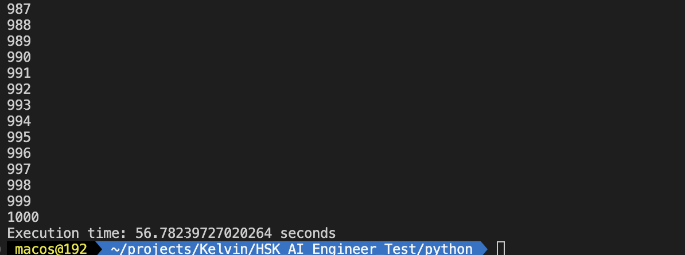

# Convert SCRFD in C++

## Compare Python and C++ for the same task on CPU

The time inference of Python and C++ for the same task on CPU is almost the same. The difference is not significant.

| Task | Python | C++ |
| --- | --- | --- |
| Inference image | ~ 60 ms | ~ 50 ms |
| Inference video (1000 frame) | ~ 56 s | ~ 53 s |

Evidence:

- Python
  - Inference image
    - 
  - Inference video
    - 

- C++
    - Inference image
        - 
    - Inference video
        - 

**Note**:

- Because do not have GPU, so I only test on CPU.
- If using GPU, the time inference will be faster 10 times with C++.

## How to run

### Python

```bash
cd python
pip install -r requirements.txt
python predict_image.py
python predict_video.py
```

### C++

```bash
sh build.sh

or
./build/lite.ai.toolkit/bin/predict_images
./build/lite.ai.toolkit/bin/predict_video
```

## Output

All output images and videos are saved in the `results` folder.

Output model:

